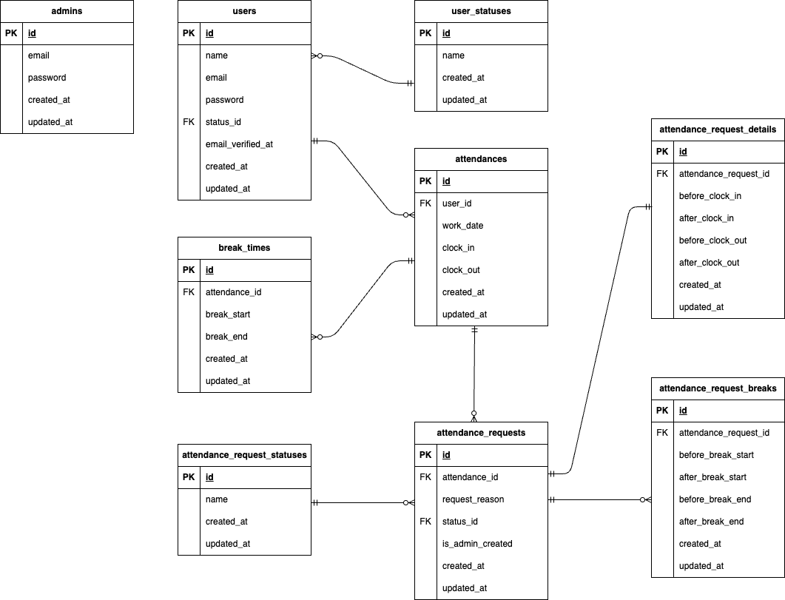

# time-attendance-management-app

## 環境構築

### Dockerビルド
1. プロジェクトのルートディレクトリに移動し、以下のコマンドでクローンします</br>
HTTP形式：
`git clone https://github.com/yurikoUe/time-attendance-management-app.git`  
SSH形式：
`git clone git@github.com:yurikoUe/time-attendance-management-app.git`

2. `docker-compose up -d --build`
>MacのM1・M2チップのPCの場合、`no matching manifest for linux/arm64/v8 in the manifest list entries`のメッセージが表示され、ビルドができないことがあります。エラーが発生した場合は、docker-compose.ymlファイルの「mysql」の記述箇所に、platformの項目を追加で記載し、もう一度ビルドしてください。
```
mysql:
    platform: linux/x86_64（この文を追加）
    image: mysql:8.0.26
    environment:
```
3. DockerDesktopアプリでコンテナが起動していることを確認してください

### Laravel環境構築
1. `docker-compose exec php bash`
2. `composer install`
3. 「.env.example」ファイルを「.env」ファイルに命名変更するか、以下のコマンドで「.env.example」をコピーして「.env」を作成。

`cp .env.example .env`

4. .envファイル内のDBの箇所を以下のように変更
```env
DB_CONNECTION=mysql
DB_HOST=mysql
DB_PORT=3306
DB_DATABASE=laravel_db
DB_USERNAME=laravel_user
DB_PASSWORD=laravel_pass
```

5. アプリケーションキーの作成をします

`php artisan key:generate`

6. マイグレーションの実行をします

`php artisan migrate`

7. シーディングの実行

`php artisan db:seed`

  
## メール認証の設定

このアプリケーションでは、メール認証が必要です。ユーザーが登録後、「メール認証」を完了するまで、ログインできないように設定されています。以下の手順でメール認証を使用するための設定を行ってください。

1. `.env` ファイルで、以下のメール関連の設定を行います。

    ```env
    MAIL_MAILER=smtp
    MAIL_HOST=mock-time-attendance-management-app-1  #Dockerコンテナ名（環境によって異なる場合があります）
    MAIL_PORT=1025
    MAIL_USERNAME=null
    MAIL_PASSWORD=null
    MAIL_ENCRYPTION=null
    MAIL_FROM_ADDRESS=no-reply@timeattendancemanagementapp.local  # 必要に応じて変更
    MAIL_FROM_NAME="${APP_NAME}"
    ```

    **注意:** `MAIL_HOST` は、Mailhogのコンテナ名で設定してください。`docker ps` コマンドでMailhogのコンテナ名（例: `mock-furima-mailhog-1`）を確認できます。

2. 認証方法
- メール認証機能を動作させるためには、ユーザーが登録後に受信したメール内のリンクをクリックして、認証を完了する必要があります。Mailhogのウェブインターフェース (`http://localhost:8025`) でメールを確認できます。

3. ログインの制御確認
- usersテーブルのemail_verified_atカラムが null の場合、ログインできません。登録後、認証をすることにより、email_verified_atカラムがに認証時の時間が入ります。

## ルーティング構成について

    本プロジェクトでは役割ごとにルートを分割管理しており、routes/ 配下に web.php のほか user.php（一般ユーザー用）、admin.php（管理者用）のルートファイルを設置しています。RouteServiceProvider にて読み込み設定済みです。    

## テストアカウント  

### 一般ユーザー
| メールアドレス | パスワード |
| ------------- | ------------- |
| taro@example.com | password |
| reina@example.com | password |
| masuda@example.com | password |
| yamamoto@example.com | password |
| tomomi@example.com | password |
| toshio@example.com | password |


### 管理者
| メールアドレス | パスワード |
| ------------- | ------------- |
| admin@example.com | adminpassword |


  
  
## PHPUnitを利用したテストに関して

1. テスト準備

    1. MySQLコンテナからMySQLに、rootユーザでログインして、demo_testというデータベースを作成します。

        新規でデータベースを作成する際は、権限の問題でrootユーザ（管理者)でログインする必要があります。

        1. `docker compose exec mysql bash`
        2. `mysql -u root -p`

        3.パスワードを求められるので、docker-compose.ymlファイルのMYSQL_ROOT_PASSWORD:に設定されているrootを入力します。

        4. MySQLログイン後、以下のコードでdemo_testというデータベースを作成します。
        ```
        CREATE DATABASE demo_test;
        ```

        5. 以下のコードで、demo_testが作成されていれば成功です。
        ```
        SHOW DATABASES;
        ```
    
    2. configファイルの変更

        configディレクトリの中のdatabase.phpを開き、mysql_testがあることを確認してください。（ない場合は、mysqlの配列部分をコピーして、その下に新たにmysql_testを作成します。）

        配列の中のdatabase、username、passwordは以下であることを確認してください。

        **'database' => 'demo_test',**  
        **'username' => 'root',**  
        **'password' => 'root',**  

        ＜以下、参照＞

        ```database.php
        'mysql_test' => [
            'driver' => 'mysql',
            'url' => env('DATABASE_URL'),
            'host' => env('DB_HOST', '127.0.0.1'),
            'port' => env('DB_PORT', '3306'),
            'database' => 'demo_test',
            'username' => 'root',
            'password' => 'root',
            'unix_socket' => env('DB_SOCKET', ''),
            'charset' => 'utf8mb4',
            'collation' => 'utf8mb4_unicode_ci',
            'prefix' => '',
            'prefix_indexes' => true,
            'strict' => true,
            'engine' => null,
            'options' => extension_loaded('pdo_mysql') ? array_filter([
                PDO::MYSQL_ATTR_SSL_CA => env('MYSQL_ATTR_SSL_CA'),
            ]) : [],
        ],
        ```

    3. テスト用の.envファイルの設定

        1. .env.testingというファイルがなければ、PHPコンテナにログインし、.envをコピーして.env.testingというファイルを作成します。

        ```PHPコンテナ上
        cp .env .env.testing
        ```

        2. ファイルの作成ができたたら、.env.testingファイルの文頭部分にあるAPP_ENVとAPP_KEYを以下のように編集します。

        ```
        APP_ENV=test
        APP_KEY=
        ```

        3. .env.testingにデータベースの接続情報を以下のように編集してください。

        ```
        DB_DATABASE=demo_test
        DB_USERNAME=root
        DB_PASSWORD=root
        ```

        4. 先ほど「空」にしたAPP_KEYに新たなテスト用のアプリケーションキーを加えるために以下のコマンドを実行します。

        ```
        php artisan key:generate --env=testing
        ```

        5. キャッシュをクリアします。
        ```
        php artisan config:clear
        ```

        6. マイグレーションコマンドを実行して、テスト用のテーブルを作成します。
        ```
        php artisan migrate --env=testing
        ```


3. テスト実行

    テストは以下のコマンドで実行できます。

    ```
    vendor/bin/phpunit tests/Feature/RegisterUserTest.php  #テストファイル名を変えて実行してください
    ```


    テストファイル名一覧:  

    | 項目 | テストファイル名 |
    | ------------- | ------------- |
    | 認証機能（一般ユーザー）| RegisterUserTest.php |
    | ログイン認証機能（一般ユーザー）| UserLoginTest.php |
    | ログイン認証機能（管理者）| AdminLoginTest.php |
    | 日時取得機能| AttendanceDateTimeTest.php |
    | ステータス確認機能| AttendanceStatusTest.php |
    | 出勤機能| AttendanceClockInTest.php |
    | 休憩機能| BreakFunctionTest.php |
    | 退勤機能| AttendanceClockOutTest.php |
    | 退勤一覧情報取得機能（一般ユーザー）| AttendanceListTest.php |
    | 勤怠詳細情報取得機能（一般ユーザー）| AttendanceDetailTest.php |
    | 退勤詳細情報修正機能（一般ユーザー）| AttendanceEditValidationTest.php |
    | 勤怠一覧情報取得機能（管理者）| AdminAttendanceListTest.php |
    | 勤怠詳細情報取得・修正機能（管理者）| AdminAttendanceDetailTest.php |
    | ユーザー情報取得機能（管理者）| AdminStaffAttendanceTest.php |
    | 勤怠情報修正機能（管理者）| AttendanceCorrectionRequestTest.php |
    | メール認証機能| MailVerificationTest.php |


## 使用技術
- **Laravel**: 8.75
- **Docker**: 最新版
- **MySQL**: 8.0.26
- **PHP**: 7.4.9
- **Nginx**: 1.21.1
- **phpMyAdmin**

## ER図

以下は、プロジェクトのER図です。




## URL
+ 開発環境: http://localhost/
+ phpMyAdmin: http://localhost:8080/
+ Mailhog: http://localhost:8025